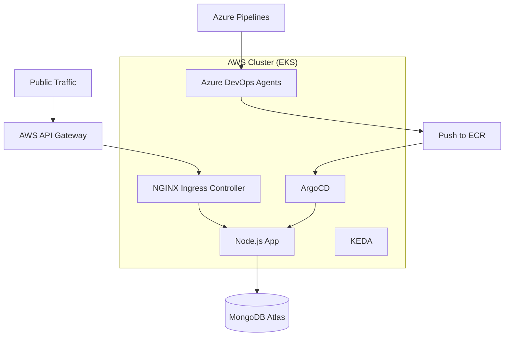

# DevOps Infrastructure & GitOps Project

This project provisions a production-ready Kubernetes infrastructure on AWS using Terraform, featuring an EKS cluster, ephemeral Azure DevOps agents, and GitOps-powered continuous delivery with ArgoCD.

## 🏗️ Architecture



## 🚀 Core Technologies
- **Infrastructure**: AWS (VPC, EKS, API Gateway, ECR, SSM)
- **IAC**: Terraform
- **Orchestrator**: Amazon EKS v1.30
- **Scaling**: KEDA (Kubernetes Event-driven Autoscaling)
- **GitOps**: ArgoCD
- **App Stack**: Node.js, Express, MongoDB Atlas
- **Security**: AWS Cognito (JWT-based Authorization for API Gateway)

---

## 🔒 Security Model
The API Gateway is protected by **AWS Cognito**. Users must authenticate against the Cognito User Pool to receive a JWT token, which must be included in the `Authorization` header for all requests to the `$default` route.

- **Authorizer**: JWT Authorizer in API Gateway.
- **Identity Source**: `$request.header.Authorization`.
- **Identity Provider**: AWS Cognito User Pool.

## 🛠️ Step 1: Manual Secret Setup (Crucial)
Terraform reads secrets from **AWS SSM Parameter Store** for security. You must create these manually before running Terraform:

### 1.1 Azure DevOps PAT
Required for ephemeral agents. Scope: **Agent Pools (Read & Manage)**.
```bash
aws ssm put-parameter --name "/devops-infrastructure/azuredevops-pat" --value "YOUR_PAT" --type "SecureString"
```

### 1.2 MongoDB URI
```bash
aws ssm put-parameter --name "/devops-infrastructure/mongodb-uri" --value "mongodb+srv://..." --type "SecureString"
```

### 1.3 Datadog API Key (Optional)
```bash
aws ssm put-parameter --name "/devops-infrastructure/datadog-api-key" --value "YOUR_KEY" --type "SecureString"
```

---

## 📦 Step 2: Infrastructure Deployment
```bash
cd terraform
terraform init
terraform apply -auto-approve
```

---

## 🤖 Step 3: Ephemeral Agent Setup
The project uses a custom Docker image for agents to ensure consistency and resolve dependency issues.

### 3.1 Build & Push Agent Image
```bash
# Login to ECR
aws ecr get-login-password --region us-east-1 | docker login --username AWS --password-stdin $(terraform output -raw agent_ecr_repository_url)

# Build, Tag, and Push
cd ../agent
docker build -t azp-agent .
docker tag azp-agent:latest $(terraform output -raw agent_ecr_repository_url):latest
docker push $(terraform output -raw agent_ecr_repository_url):latest
```

---

## 🚢 Step 4: Application Deployment (GitOps)
ArgoCD is installed in the `argocd` namespace.

1. **Get Admin Password**:
   ```bash
   kubectl -n argocd get secret argocd-initial-admin-secret -o jsonpath="{.data.password}" | base64 -d
   ```
2. **Apply GitOps App**:
   ```bash
   kubectl apply -f k8s/argocd-app.yaml
   ```

---

## 🧪 Verification & Operations

### Monitoring Agents
When a job is queued in Azure DevOps, KEDA will automatically scale up a pod in the `azuredevops-agents` namespace.
```bash
kubectl get pods -n azuredevops-agents -w
```

### Accessing the App
Get the API Gateway URL or the NGINX LoadBalancer URL:
```bash
kubectl get svc -n ingress-nginx
```

---

## 🧹 Cleanup
```bash
terraform destroy -auto-approve
```

---
*Created with ❤️ by the DevOps Team*
